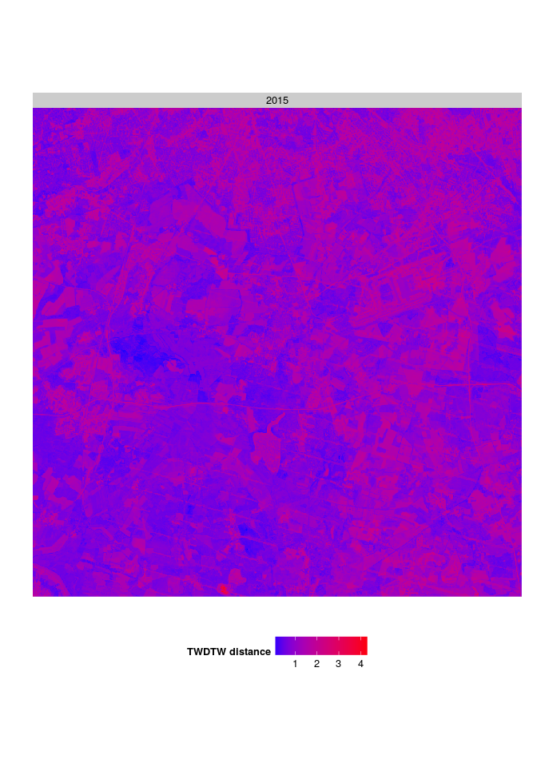

# High resolution

``` r
output_dir = "report"
```

<!-- Chunk settings -->

Install dtwSat package
======================

``` r
install.packages(c("dtwSat", "scales", "reshape2", "xtable"))
```

Read input data
===============

``` r
library(dtwSat)
library(scales)
library(reshape2)
library(xtable)

# Read raster file 
ndvi = brick("./data/NDVI_time-series_DOY1-360_25k-aoi.img")

# Read time information 
dates = scan("./data/timeline",what="Date")
dates
```

    ##  [1] "2015-01-10" "2015-01-30" "2015-02-19" "2015-03-11" "2015-03-31"
    ##  [6] "2015-04-20" "2015-05-10" "2015-05-30" "2015-06-19" "2015-07-09"
    ## [11] "2015-07-29" "2015-08-18" "2015-09-07" "2015-09-27" "2015-10-17"
    ## [16] "2015-11-06" "2015-11-26" "2015-12-16"

``` r
# Read samples 
field_samples = read.csv("./data/samples.csv")
field_samples
```

    ##     X             label    x    y longitude latitude       from         to
    ## 1   1 Grassland-managed  646  939    392060  5792900 2015-01-10 2015-12-16
    ## 2   2             Wheat  794  895    395020  5793780 2015-01-10 2015-12-16
    ## 3   3          Hayfield  785  893    394840  5793820 2015-01-10 2015-12-16
    ## 4   4          Hayfield  616 1102    391460  5789640 2015-01-10 2015-12-16
    ## 5   5             Wheat  550 1130    390140  5789080 2015-01-10 2015-12-16
    ## 6   6              Corn  548 1081    390100  5790060 2015-01-10 2015-12-16
    ## 7   7          Rapeseed  404 1021    387220  5791260 2015-01-10 2015-12-16
    ## 8   8             Wheat  403  994    387200  5791800 2015-01-10 2015-12-16
    ## 9   9               Oat  398  999    387100  5791700 2015-01-10 2015-12-16
    ## 10 10 Coniferous Forest 4193 5040    383840  5799220 2015-01-10 2015-12-16
    ## 11 11             Water 4561 5276    391200  5794500 2015-01-10 2015-12-16
    ## 12 12  Deciduous Forest 4235 5060    384680  5798820 2015-01-10 2015-12-16
    ## 13 13         Grassland 4367 5103    387320  5797960 2015-01-10 2015-12-16

<!-- Set global env -->
Create raster time series object
================================

``` r
# Create raster time series 
rts = twdtwRaster(ndvi, timeline=dates, filepath = output_dir, 
                  format="GTiff", overwrite=TRUE)
rts
```

    ## An object of class "twdtwRaster"
    ## Time series layers: doy ndvi 
    ## Time range: 2015-01-10 ... 2015-12-16 
    ## dimensions: 2 1250 1250 18 (nlayers, nrow, ncol, length)
    ## resolution: 20 20  (x, y)
    ## extent    : 379160 404160 5786660 5811660 (xmin, xmax, ymin, ymax)
    ## coord.ref.: +proj=utm +zone=33 +datum=WGS84 +units=m +no_defs +ellps=WGS84 +towgs84=0,0,0

Get time series and create temporal patterns
============================================

``` r
# Get field samples time sereis 
field_samples_ts = getTimeSeries(rts, y=field_samples, proj4string = projection(rts)) 
field_samples_ts
```

    ## An object of class "twdtwTimeSeries"
    ## Slot "timeseries" length: 13 
    ## Slot "labels": [1] Grassland-managed Wheat             Hayfield         
    ## 10 Levels: Coniferous Forest Corn Deciduous Forest ... Wheat

``` r
# Plot sample time series  
plot(field_samples_ts, type="timeseries") + 
    facet_wrap(~Series, scales = "free_x", ncol=4) 
```


<p class="caption">
Field samples of Sentinel time series.
</p>

``` r
# Create temporal patterns 
sentinel_patterns = createPatterns(x = field_samples_ts, formula=y~s(x))
sentinel_patterns
```

    ## An object of class "twdtwTimeSeries"
    ## Slot "timeseries" length: 10 
    ## Slot "labels": [1] Coniferous Forest Corn              Deciduous Forest 
    ## 10 Levels: Coniferous Forest Corn Deciduous Forest ... Wheat

``` r
# Plot temporal patterns 
plot(sentinel_patterns, type="patterns")
```


<p class="caption">
Sentinel temporal patterns.
</p>

Apply TWDTW analysis and classify raster time series
====================================================

The smoothed temporal patterns don not look good. Therefore, the test runs using the raw samples (in `field_samples_ts`) extracted from the raster time series.

``` r
# Define weight function 
log_fun = logisticWeight(alpha=-0.1,beta=50)
# Apply TWDTW analysis
proc_time = system.time(
  twdtw_res <- twdtwApply(x=rts, y=field_samples_ts, weight.fun=log_fun, format="GTiff", 
                          filepath = output_dir, overwrite=TRUE, 
                          mc.cores=10, chunk.size=1000)
)
save(twdtw_res, file="twdtw_res.RData")
```

``` r
# Processing time in min 
proc_time/60
```

    ##      user    system   elapsed 
    ## 6149.8358  375.3689 1679.6704

``` r
# Plot land use maps 
plot(x=twdtw_res, type = "distance")
```


<p class="caption">
TWDTW distances for each class.
</p>

``` r
# Classify results 
postproc_time = system.time(
  classification <- twdtwClassify(x = twdtw_res, format="GTiff", overwrite=TRUE)
)
# Post-processing time in min 
postproc_time/60
```

    ##        user      system     elapsed 
    ## 0.850950000 0.005766667 0.865466667

``` r
save(classification, file = "classification.RData")
```

Visualising the results
=======================

``` r
# Plot land use maps 
plot(x=classification, type = "maps")
```


<p class="caption">
Land use maps.
</p>

``` r
# Plot TWDTW distance 
plot(x=classification, type = "distance")
```


<p class="caption">
TWDTW distance measure.
</p>


